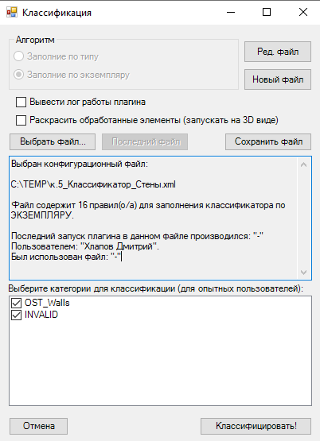
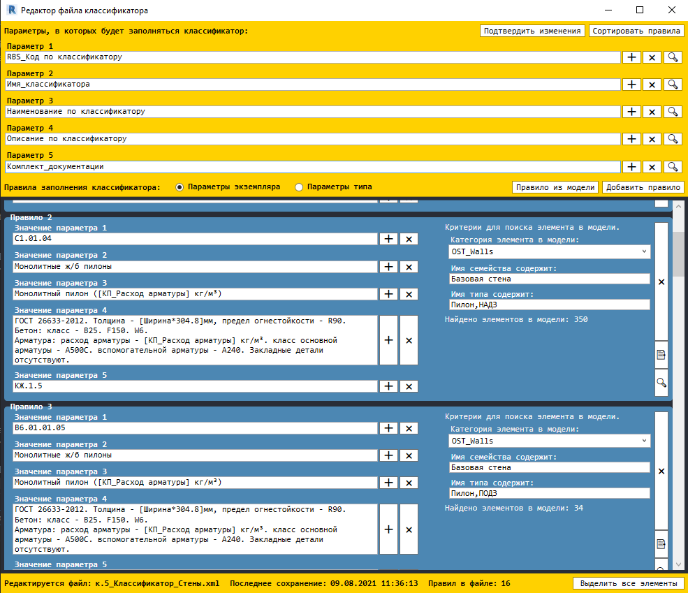
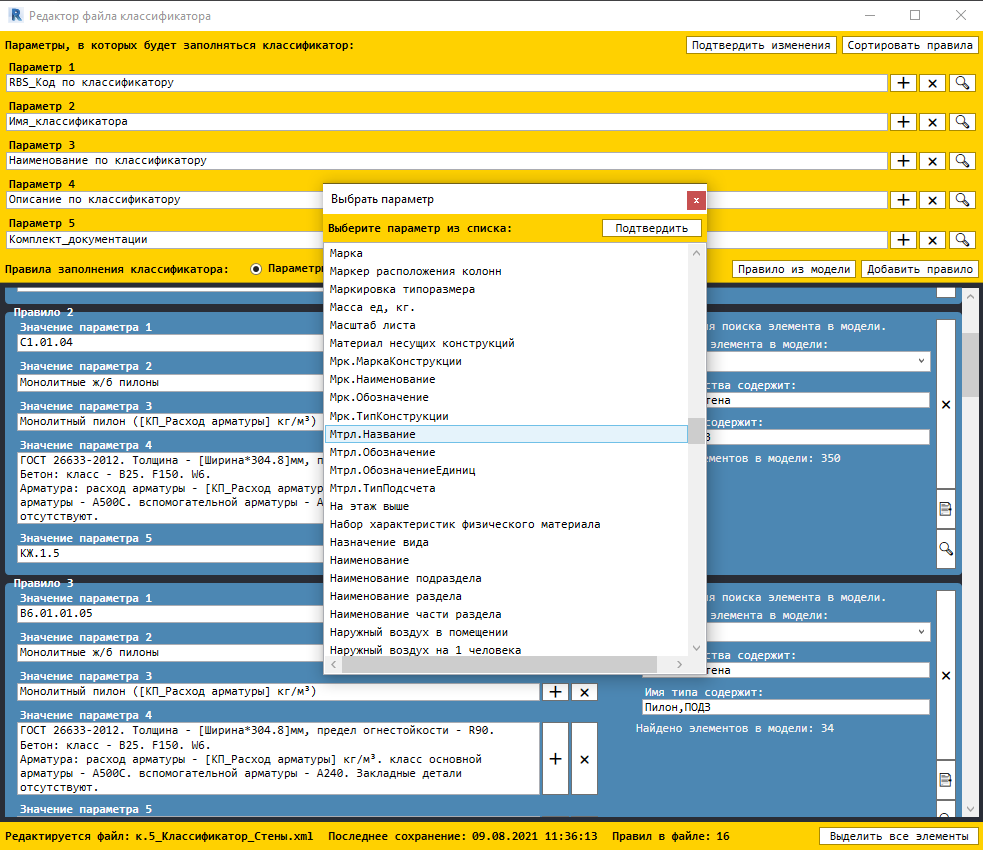

# Classificator Complete
> Classificator Complete is a plug-in for parameterizing elements in Revit according to specified rules. 
	The user can create rules in the editor and save them for later use.
  

## Table of contents
* [General info](#general-info)
* [Technologies](#technologies)
* [Features](#features)
* [Status](#status)
* [Contact](#contact)
* [Screenshots](#screenshots)

## General info
The user can create files with a set of rules for parameterizing elements in the model, depending on a specific situation. 
The rules contain information about the internal category of an element, its family name and type. 
This allows the plugin to find this element in the model and parameterize it. 
Also, the rules contain a set of values ​​for the filled parameters (there can be as many as you like). 
The parameters for parameterizing are selected in the header of the rules editor for the entire document.

## Technologies
* .NET Framework 4.7.2
* WPF MVVC
* Windows Forms
* Revit API 2018, 2020

## Features
List of features
* Tools for creating rule files
* Import / export rule files to xml
* Mapping parameters inside an element
* Adapting the plugin for any loader
* Plugin execution logging
* Tools for finding items in a model

To-do list:
* Storing files in the DB
* Add additional filters for items

## Status
Project is: _in progress_

## Contact
Created by Khlapov Dmitry - feel free to contact me!

## Screenshots

